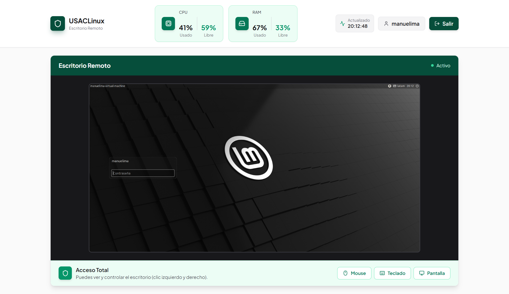

# Proyecto Único: USACLinux - Escritorio Remoto Web

## Datos Personales

| Nombre | Carlos Manuel Lima Y Lima |
| --- | --- |
| Registro Académico | 202201524 |
| Curso | Sistemas Operativos 2, Sección A |

## Introducción

Esta documentación detalla el proceso seguido para implementar el proyecto USACLinux: Escritorio Remoto Web, el cual consiste en la creación de un sistema de administración remota para equipos Linux mediante la implementación de llamadas al sistema personalizadas en el kernel de Linux, versión [6.12.41]. El objetivo principal es desarrollar una solución integral que permita el acceso y control remoto de equipos Linux a través de una interfaz web intuitiva, integrando funcionalidades de monitorización de recursos (CPU y memoria RAM), visualización del escritorio en tiempo real y control remoto del mouse y teclado.

El proyecto se estructura en tres capas principales:

1. **Llamadas al Sistema Personalizadas**  
   Implementadas en el kernel (`sys_cpu_percentage`, `sys_ram_percentage`, `sys_control_mouse_click`), estas llamadas proporcionan acceso directo a los recursos del sistema y control sobre los botones del mouse.

2. **API Intermediaria**  
   Desarrollada en C, traduce las peticiones HTTP a llamadas al sistema y gestiona la autenticación mediante **PAM**.

3. **Aplicación Web**  
   Ofrece una interfaz gráfica para interactuar con el sistema remoto.  
   La seguridad se implementa mediante **autenticación PAM** y control de acceso basado en grupos (`remote_view` y `remote_control`).


Las llamadas al sistema se implementaron en archivos separados dentro del directorio `kernel/` para mantener una estructura organizada. Se modificó la tabla de syscalls (`arch/x86/entry/syscalls/syscall_64.tbl`) y el `Makefile` del kernel para integrar las nuevas funcionalidades. La API fue desarrollada en `C` y la aplicación web fue implementada utilizando `React + Vite + Tailwindcss`.

---

## Objetivos De Cada Nueva Syscall

### sys_cpu_percentage (syscall_pf_1.c)

- **Propósito:** Obtener el porcentaje de uso total de la CPU del sistema en tiempo real, proporcionando información agregada de todos los núcleos de procesamiento disponibles.
- **Objetivo logrado:** Se implementó una syscall que accede a las estadísticas de CPU del kernel mediante la estructura `kernel_cpustat`, agregando los tiempos de todos los núcleos (user, nice, system, idle, iowait, irq, softirq, steal) para calcular el porcentaje total de uso activo y ocioso del procesador. La implementación utiliza `for_each_possible_cpu` para iterar sobre todos los CPUs disponibles, convierte los tiempos de nanosegundos a ticks de reloj con `nsec_to_clock_t`, y calcula porcentajes precisos evitando divisiones por cero. La syscall transfiere los resultados de manera segura al espacio de usuario mediante `copy_to_user`, proporcionando tanto el porcentaje usado como el no usado en una estructura `informacion_cpu`, permitiendo al sistema de monitorización web mostrar el estado de la CPU en tiempo real.

### sys_ram_percentage (syscall_pf_2.c)

- **Propósito:** Obtener el porcentaje de uso de la memoria RAM del sistema en tiempo real, proporcionando información sobre la cantidad de memoria utilizada y disponible.
- **Objetivo logrado:** Se implementó una syscall que accede a las estadísticas de memoria del kernel mediante la función `si_meminfo()`, la cual llena una estructura `sysinfo` con información actualizada del sistema. La implementación calcula el porcentaje de memoria utilizada comparando la memoria total (`totalram`) con la memoria libre (`freeram`), obteniendo así el uso real de RAM. La syscall realiza validación contra división por cero y transfiere los resultados de manera segura al espacio de usuario mediante `copy_to_user()`, proporcionando tanto el porcentaje usado como el no usado en una estructura `informacion_ram`. Esta funcionalidad es esencial para el dashboard de monitorización del escritorio remoto, permitiendo visualizar el estado de la memoria en tiempo real.

### sys_control_mouse_click (syscall_pf_3.c)

- **Propósito:** Controlar el mouse del sistema de forma remota, permitiendo mover el cursor a coordenadas específicas y ejecutar clicks izquierdos o derechos de manera programática.
- **Objetivo logrado:** Se implementó una syscall que utiliza la API de dispositivos de entrada del kernel (`input subsystem`) para crear un dispositivo de mouse virtual que puede inyectar eventos de movimiento y clicks. La implementación incluye la inicialización automática del dispositivo mediante `device_initcall()`, detección dinámica de la resolución de pantalla leyendo `/sys/class/drm/card0-Virtual-1/modes`, configuración de límites absolutos para las coordenadas X e Y basados en la resolución detectada, y validación de coordenadas para prevenir valores fuera de rango. La syscall reporta eventos de movimiento absoluto con `input_report_abs()` y simula clicks mediante la secuencia de presionar (`input_report_key` con valor 1), sincronizar, esperar 20ms con `msleep()`, y liberar el botón (valor 0), emulando el comportamiento natural de un click físico. Esta funcionalidad es crítica para el control remoto del equipo, permitiendo a usuarios autorizados del grupo `remote_control` interactuar con el escritorio mediante la interfaz web.

---

## Detalle de los Pasos Seguidos para Modificar el Kernel, Compilarlo e Instalarlo

Los pasos descritos a continuación se siguieron para implementar las llamadas al sistema personalizadas en el kernel de Linux, versión [6.12.41]. Las modificaciones se integraron en el proceso de compilación e instalación, realizados en una máquina virtual VMware con Linux Mint, en el directorio `~/Documentos/LaboratorioSopes2/linux-6.12.41`.

### Agregado de Entradas en la Tabla de Syscalls

Se modificó el archivo `arch/x86/entry/syscalls/syscall_64.tbl` para registrar las syscalls con números secuenciales:

```bash
556 common cpu_percentage sys_cpu_percentage
557 common ram_percentage sys_ram_percentage
558 common control_mouse_click sys_control_mouse_click
```

### Creación de Archivos Para las Syscalls

Se crearon tres archivos en el directorio `kernel/`:

- **`syscall_pf_1.c`** para la implementación de `sys_cpu_percentage`, syscall que obtiene el porcentaje de uso de CPU del sistema agregando estadísticas de todos los núcleos disponibles mediante acceso a las estructuras `kernel_cpustat`.

- **`syscall_pf_2.c`** para la implementación de `sys_ram_percentage`, syscall que calcula el porcentaje de uso de memoria RAM utilizando la función `si_meminfo()` para acceder a las estadísticas de memoria del kernel.

- **`syscall_pf_3.c`** para la implementación de `sys_control_mouse_click`, syscall que controla el mouse del sistema mediante la creación de un dispositivo de entrada virtual, permitiendo movimiento del cursor y ejecución de clicks izquierdos y derechos.

Cada archivo contiene la implementación completa de la respectiva syscall, incluyendo las definiciones de estructuras para transferencia de datos entre kernel y espacio de usuario, la lógica de procesamiento de estadísticas del sistema o control de dispositivos, validaciones de seguridad para prevenir accesos inválidos, funciones auxiliares cuando son necesarias (como `obtener_resolucion_pantalla()` en `syscall_pf_3.c`), funciones de inicialización de dispositivos virtuales (en el caso de `syscall_pf_3.c` con `device_initcall()`), y mensajes de log con `pr_info()` para facilitar la depuración y monitoreo del comportamiento de las syscalls.

---

### Actualización del Makefile

Se modificó `kernel/Makefile` para incluir los nuevos archivos objeto en la compilación:

Fragmento de código (`kernel/Makefile`):

```makefile
obj-y = fork.o exec_domain.o panic.o \
	    cpu.o exit.o softirq.o resource.o \
	    sysctl.o capability.o ptrace.o user.o \
	    signal.o sys.o umh.o workqueue.o pid.o task_work.o \
	    extable.o params.o \
	    kthread.o sys_ni.o nsproxy.o \
	    notifier.o ksysfs.o cred.o reboot.o \
	    async.o range.o smpboot.o ucount.o regset.o ksyms_common.o \
		syscall_usac1.o syscall_usac2.o syscall_usac3.o \
		syscall_P2_1.o syscall_P2_2.o syscall_P2_3.o \
		syscall_pf_1.o syscall_pf_2.o syscall_pf_3.o \
```

### Compilación del Kernel

Se compiló el kernel utilizando todos los núcleos disponibles:

```bash
make -j$(nproc)
```

### Instalación de Módulos y Kernel

Se instalaron los módulos del kernel y el kernel compilado:

```bash
sudo make modules_install
sudo make install
```

### Reinicio y Verificación

Se reinició el sistema para cargar el nuevo kernel:

```bash
sudo reboot
```

Se verificó que el kernel correcto estuviera en uso:

```bash
uname -r
```

Salida esperada: `[6.12.41-carlos-lima-202201524]`.

---

## Implementación de sys_cpu_percentage

La syscall `sys_cpu_percentage` permite obtener información en tiempo real sobre el uso del procesador del sistema, agregando las estadísticas de todos los núcleos de CPU disponibles. Esta implementación se encuentra en el archivo `kernel/syscall_pf_1.c` y proporciona datos esenciales para el sistema de monitorización del escritorio remoto.

### Fragmento de Código Relevante

```c
struct informacion_cpu {
    int porcentaje_usado;
    int porcentaje_no_usado;
};

SYSCALL_DEFINE1(cpu_percentage, struct informacion_cpu __user *, info)
{
    struct informacion_cpu info_k;
    u64 user, nice, system, idle, iowait, irq, softirq, steal;
    u64 total_tiempo, total_idle, total_activo;
    int cpu;
    
    // INICIALIZAR VARIABLES DESDE CERO
    user = nice = system = idle = iowait = irq = softirq = steal = 0;
    
    // SUMAR LAS ESTADÍSTICAS DE TODOS LOS CPU
    for_each_possible_cpu(cpu) {
        struct kernel_cpustat *kcpustat = &kcpustat_cpu(cpu);
        user    += kcpustat->cpustat[CPUTIME_USER];
        nice    += kcpustat->cpustat[CPUTIME_NICE];
        system  += kcpustat->cpustat[CPUTIME_SYSTEM];
        idle    += kcpustat->cpustat[CPUTIME_IDLE];
        iowait  += kcpustat->cpustat[CPUTIME_IOWAIT];
        irq     += kcpustat->cpustat[CPUTIME_IRQ];
        softirq += kcpustat->cpustat[CPUTIME_SOFTIRQ];
        steal   += kcpustat->cpustat[CPUTIME_STEAL];
    }
    
    // CALCULAR TIEMPOS TOTALES
    total_tiempo = nsec_to_clock_t(user + nice + system + idle + iowait + irq + softirq + steal);
    total_idle = nsec_to_clock_t(idle + iowait + steal);
    total_activo = total_tiempo - total_idle;
    
    // CALCULAR PORCENTAJES DE USO
    if (total_tiempo > 0) {
        info_k.porcentaje_usado = (int)((total_activo * 100) / total_tiempo);
    } else {
        info_k.porcentaje_usado = 0;
    }
    info_k.porcentaje_no_usado = 100 - info_k.porcentaje_usado;
    
    if (copy_to_user(info, &info_k, sizeof(struct informacion_cpu))) {
        return -EFAULT;
    }
    
    return 0;
}
```

### Explicación de la Implementación

**Inicialización y Estructura de Datos:**

- **Propósito:** Define la estructura `informacion_cpu` para transferir los porcentajes de uso entre el kernel y el espacio de usuario, con campos para el porcentaje usado y no usado del CPU.
- **Funcionamiento:**
    - Se declaran variables de tipo `u64` (unsigned 64-bit) para almacenar los tiempos acumulados de CPU en diferentes estados: `user` (tiempo en modo usuario), `nice` (procesos de baja prioridad), `system` (tiempo en modo kernel), `idle` (CPU inactiva), `iowait` (esperando I/O), `irq` (manejando interrupciones hardware), `softirq` (interrupciones software), y `steal` (tiempo robado en entornos virtualizados).
    - Todas las variables se inicializan en cero para garantizar la correcta agregación de estadísticas.

**Lógica de la Syscall:**

- **Propósito:** Calcular el porcentaje agregado de uso de CPU de todos los núcleos del sistema.
- **Funcionamiento:**
    - **Agregación de Estadísticas:** Utiliza la macro `for_each_possible_cpu(cpu)` para iterar sobre todos los CPUs disponibles en el sistema (incluyendo CPUs offline que pueden activarse). Para cada CPU, accede a su estructura `kernel_cpustat` mediante `kcpustat_cpu(cpu)`, que contiene contadores de tiempo para cada estado del procesador.
    - **Acumulación de Tiempos:** Suma los valores de cada estado (`CPUTIME_USER`, `CPUTIME_NICE`, etc.) de todos los CPUs en las variables globales correspondientes, obteniendo tiempos totales del sistema completo.
    - **Conversión de Unidades:** Convierte los tiempos de nanosegundos (unidad interna del kernel) a ticks de reloj usando `nsec_to_clock_t()`, facilitando cálculos de porcentaje más precisos y compatibles con las convenciones del sistema.
    - **Cálculo de Totales:** Suma todos los tiempos para obtener `total_tiempo` (tiempo total transcurrido). Calcula `total_idle` sumando los estados de inactividad (`idle`, `iowait`, `steal`), y obtiene `total_activo` restando el tiempo idle del total.
    - **Cálculo de Porcentajes:** Realiza una división protegida verificando que `total_tiempo > 0` para evitar división por cero. Calcula el porcentaje usado como `(total_activo * 100) / total_tiempo` y el porcentaje no usado como `100 - porcentaje_usado`, garantizando que la suma sea exactamente 100%.
    - **Transferencia Segura:** Utiliza `copy_to_user()` para copiar la estructura `info_k` desde el espacio del kernel al buffer proporcionado por el usuario (`info`). Si la copia falla (por dirección inválida o permisos insuficientes), retorna `-EFAULT`.
    - **Retorno:** Devuelve `0` en caso de éxito, indicando que los porcentajes fueron calculados y transferidos correctamente.

---

## Implementación de sys_ram_percentage

La syscall `sys_ram_percentage` permite obtener información en tiempo real sobre el uso de memoria RAM del sistema. Esta implementación se encuentra en el archivo `kernel/syscall_pf_2.c` y complementa la monitorización de recursos del sistema junto con la syscall de CPU.

### Fragmento de Código Relevante

```c
struct informacion_ram {
    int porcentaje_usado;
    int porcentaje_no_usado;
};

SYSCALL_DEFINE1(ram_percentage, struct informacion_ram __user *, info)
{
    struct informacion_ram info_k;
    unsigned long total_mem, free_mem;
    struct sysinfo si;

    // OBTENER INFORMACIÓN DE MEMORIA DEL SISTEMA
    si_meminfo(&si);
    total_mem = si.totalram;
    free_mem = si.freeram;

    // CALCULAR PORCENTAJES DE USO
    if (total_mem > 0) {
        info_k.porcentaje_usado = (int)((((total_mem - free_mem) * 100) / total_mem));
    } else {
        info_k.porcentaje_usado = 0;
    }
    info_k.porcentaje_no_usado = 100 - info_k.porcentaje_usado;

    if (copy_to_user(info, &info_k, sizeof(struct informacion_ram))) {
        return -EFAULT;
    }

    return 0;
}
```

### Explicación de la Implementación

**Inicialización y Estructura de Datos:**

- **Propósito:** Define la estructura `informacion_ram` para transferir los porcentajes de uso de memoria entre el kernel y el espacio de usuario, con campos para el porcentaje usado y no usado.
- **Funcionamiento:**
    - Se declara una estructura `sysinfo` (`si`) que será llenada con información actualizada del sistema por la función `si_meminfo()`.
    - Las variables `total_mem` y `free_mem` de tipo `unsigned long` almacenarán la memoria total del sistema y la memoria libre disponible, respectivamente.
    - La estructura `informacion_ram info_k` se utiliza como buffer intermedio en el espacio del kernel antes de transferir los datos al usuario.

**Lógica de la Syscall:**

- **Propósito:** Calcular el porcentaje de uso de memoria RAM del sistema basándose en estadísticas actualizadas del kernel.
- **Funcionamiento:**
    - **Obtención de Estadísticas:** Llama a `si_meminfo(&si)`, función del kernel que actualiza la estructura `sysinfo` con información actual del sistema, incluyendo memoria total, memoria libre, buffers, cache, swap, y otras métricas relevantes.
    - **Extracción de Datos:** Obtiene `total_mem` desde `si.totalram` (memoria RAM total instalada en páginas) y `free_mem` desde `si.freeram` (memoria RAM disponible en páginas). Estas cantidades están en unidades de páginas de memoria.
    - **Cálculo de Memoria Usada:** Calcula la memoria utilizada restando la memoria libre del total: `(total_mem - free_mem)`. Esta operación proporciona la cantidad de memoria actualmente en uso por el sistema, incluyendo procesos, cache del kernel y buffers.
    - **Cálculo de Porcentajes:** Realiza una división protegida verificando que `total_mem > 0` para evitar división por cero (aunque en la práctica esto nunca debería ocurrir en un sistema funcional). Calcula el porcentaje usado mediante la fórmula: `((memoria_usada * 100) / total_mem)`, donde la multiplicación por 100 se realiza antes de la división para mantener precisión en aritmética entera.
    - **Complemento de Porcentaje:** Calcula el porcentaje no usado como `100 - porcentaje_usado`, garantizando que ambos porcentajes sumen exactamente 100% y proporcionando una visión completa del estado de la memoria.
    - **Transferencia Segura:** Utiliza `copy_to_user()` para copiar la estructura `info_k` desde el espacio del kernel al buffer proporcionado por el usuario (`info`). Si la copia falla debido a una dirección inválida o permisos insuficientes, retorna `-EFAULT`.
    - **Retorno:** Devuelve `0` en caso de éxito, indicando que los porcentajes fueron calculados y transferidos correctamente al espacio de usuario.

---

## Implementación de sys_control_mouse_click

La syscall `sys_control_mouse_click` permite controlar el mouse del sistema de forma remota, incluyendo movimiento del cursor y ejecución de clicks izquierdos y derechos. Esta implementación se encuentra en el archivo `kernel/syscall_pf_3.c` y utiliza el subsistema de entrada del kernel para crear un dispositivo de mouse virtual.

### Fragmento de Código Relevante

```c
static struct input_dev *mouse_click_202201524;
static int ancho_pantalla = 0, alto_pantalla = 0;

int obtener_resolucion_pantalla(int *ancho, int *alto)
{
    struct file *f;
    char buf[64];
    loff_t posicion = 0;
    ssize_t resultado;
    f = filp_open("/sys/class/drm/card0-Virtual-1/modes", O_RDONLY, 0);
    if (IS_ERR(f))
        return PTR_ERR(f);
    resultado = kernel_read(f, buf, sizeof(buf) - 1, &posicion);
    filp_close(f, NULL);
    if (resultado <= 0)
        return -EFAULT;
    buf[resultado] = '\0';
    if (sscanf(buf, "%dx%d", ancho, alto) != 2)
        return -EINVAL;
    return 0;
}

static int __init mouse_click_init(void)
{
    int error;
    mouse_click_202201524 = input_allocate_device();
    if (!mouse_click_202201524) {
        pr_err("Error: No se pudo alocar el dispositivo de mouse click.\n");
        return -ENOMEM;
    }
    mouse_click_202201524->name = "Mouse Click Virtual 202201524";
    mouse_click_202201524->phys = "202201524/virtual_mouse_click";
    mouse_click_202201524->id.bustype = BUS_VIRTUAL;

    __set_bit(INPUT_PROP_POINTER, mouse_click_202201524->propbit);
    __set_bit(INPUT_PROP_DIRECT, mouse_click_202201524->propbit);

    input_set_capability(mouse_click_202201524, EV_ABS, ABS_X);
    input_set_capability(mouse_click_202201524, EV_ABS, ABS_Y);

    input_set_capability(mouse_click_202201524, EV_KEY, BTN_LEFT);
    input_set_capability(mouse_click_202201524, EV_KEY, BTN_RIGHT);

    if (obtener_resolucion_pantalla(&ancho_pantalla, &alto_pantalla) == 0) {
        pr_info("Info: Resolucion De Pantalla Detectada: %dx%d\n", ancho_pantalla, alto_pantalla);
    }

    input_set_abs_params(mouse_click_202201524, ABS_X, 0, ancho_pantalla - 1, 0, 0);
    input_set_abs_params(mouse_click_202201524, ABS_Y, 0, alto_pantalla - 1, 0, 0);

    error = input_register_device(mouse_click_202201524);
    if (error) {
        pr_err("Error: No se pudo registrar el mouse click virtual: %d.\n", error);
        input_free_device(mouse_click_202201524);
        mouse_click_202201524 = NULL;
        return error;
    }
    pr_info("Info: Mouse click virtual inicializado correctamente.\n");
    return 0;
}

device_initcall(mouse_click_init);

SYSCALL_DEFINE3(control_mouse_click, int, pos_x_abs, int, pos_y_abs, int, tipo_clic)
{
    if (!mouse_click_202201524)
        return -ENODEV;

    if (pos_x_abs < 0) pos_x_abs = 0;
    if (pos_y_abs < 0) pos_y_abs = 0;
    if (pos_x_abs >= ancho_pantalla) pos_x_abs = ancho_pantalla - 1;
    if (pos_y_abs >= alto_pantalla) pos_y_abs = alto_pantalla - 1;

    pr_info("Info: Moviendo Mouse a X, Y: (%d,%d), Click: (%d).\n", pos_x_abs, pos_y_abs, tipo_clic);
    input_report_abs(mouse_click_202201524, ABS_X, pos_x_abs);
    input_report_abs(mouse_click_202201524, ABS_Y, pos_y_abs);
    //CLICK IZQUIERDO = 1, CLICK DERECHO = 2
    if (tipo_clic == 1) {
        input_report_key(mouse_click_202201524, BTN_LEFT, 1);
        input_sync(mouse_click_202201524);
        msleep(20);
        input_report_key(mouse_click_202201524, BTN_LEFT, 0);
    } else if (tipo_clic == 2) {
        input_report_key(mouse_click_202201524, BTN_RIGHT, 1);
        input_sync(mouse_click_202201524);
        msleep(20);
        input_report_key(mouse_click_202201524, BTN_RIGHT, 0);
    }
    input_sync(mouse_click_202201524);

    return 0;
}
```

### Explicación de la Implementación

**Inicialización y Estructura de Datos:**

- **Propósito:** Crear y registrar un dispositivo de entrada virtual que permita inyectar eventos de mouse en el sistema operativo de manera transparente para las aplicaciones gráficas.
- **Funcionamiento:**
    - `mouse_click_202201524` es un puntero estático global a la estructura `input_dev` que representa el dispositivo de mouse virtual.
    - Las variables estáticas `ancho_pantalla` y `alto_pantalla` almacenan la resolución detectada del display, con valores por defecto de 1718x888.
    - La función `obtener_resolucion_pantalla()` lee dinámicamente la resolución desde el sistema de archivos virtual DRM (`/sys/class/drm/card0-Virtual-1/modes`), abriendo el archivo con `filp_open()`, leyendo su contenido con `kernel_read()`, y parseando el formato "WIDTHxHEIGHT" con `sscanf()`.

**Inicialización del Dispositivo (mouse_click_init):**

- **Propósito:** Configurar y registrar el dispositivo de mouse virtual durante el arranque del kernel.
- **Funcionamiento:**
    - **Asignación:** Llama a `input_allocate_device()` para reservar memoria para la estructura del dispositivo. Si falla, retorna `-ENOMEM`.
    - **Configuración de Identidad:** Asigna nombre descriptivo ("Mouse Click Virtual 202201524"), identificador físico único, y tipo de bus (`BUS_VIRTUAL`) para identificarlo como dispositivo virtual.
    - **Propiedades:** Establece bits de propiedades con `__set_bit()` para indicar que es un dispositivo puntero (`INPUT_PROP_POINTER`) con entrada directa (`INPUT_PROP_DIRECT`).
    - **Capacidades:** Registra capacidades con `input_set_capability()` para eventos absolutos en ejes X e Y (`EV_ABS`, `ABS_X`, `ABS_Y`) y botones izquierdo y derecho (`EV_KEY`, `BTN_LEFT`, `BTN_RIGHT`).
    - **Detección de Resolución:** Invoca `obtener_resolucion_pantalla()` para actualizar los valores de ancho y alto desde el sistema DRM.
    - **Límites de Ejes:** Configura rangos válidos para coordenadas con `input_set_abs_params()`, estableciendo mínimo 0 y máximo `ancho_pantalla - 1` / `alto_pantalla - 1` sin valores de fuzz o flat.
    - **Registro:** Registra el dispositivo con `input_register_device()`. Si falla, libera la memoria y retorna el error.
    - **Inicialización Automática:** La macro `device_initcall(mouse_click_init)` asegura que la función se ejecute automáticamente durante la fase de inicialización de dispositivos del kernel.

**Lógica de la Syscall:**

- **Propósito:** Mover el cursor a coordenadas absolutas y opcionalmente ejecutar un click.
- **Funcionamiento:**
    - **Validación de Dispositivo:** Verifica que `mouse_click_202201524` esté inicializado. Si es NULL, retorna `-ENODEV` indicando que el dispositivo no está disponible.
    - **Normalización de Coordenadas:** Aplica clipping a las coordenadas recibidas para garantizar que estén dentro de los límites de la pantalla:
        - Si `pos_x_abs < 0`, se ajusta a 0.
        - Si `pos_x_abs >= ancho_pantalla`, se ajusta a `ancho_pantalla - 1`.
        - El mismo proceso se aplica para `pos_y_abs` con `alto_pantalla`.
    - **Registro de Movimiento:** Reporta las coordenadas absolutas al subsistema de entrada con `input_report_abs()` para los ejes X e Y, moviendo efectivamente el cursor a la posición especificada.
    - **Simulación de Click:** Evalúa el parámetro `tipo_clic`:
        - **Click Izquierdo (1):** Reporta presión del botón izquierdo (`BTN_LEFT`, valor 1), sincroniza con `input_sync()`, espera 20ms con `msleep()` para simular la duración física del click, y reporta liberación del botón (valor 0).
        - **Click Derecho (2):** Mismo proceso con `BTN_RIGHT`.
        - **Solo Movimiento (0 u otros):** No ejecuta ningún click, solo mueve el cursor.
    - **Sincronización Final:** Llama a `input_sync()` para notificar al subsistema de entrada que el paquete de eventos está completo y debe procesarse.
    - **Logging:** Utiliza `pr_info()` para registrar cada acción en el log del kernel, facilitando la depuración.
    - **Retorno:** Devuelve 0 en caso de éxito.

---

## Implementación del Backend (API)

La API desarrollada en C actúa como intermediaria entre la interfaz web y las llamadas al sistema del kernel, implementando autenticación PAM y control de acceso basado en grupos. Esta implementación se encuentra en el archivo principal del servidor y utiliza la biblioteca `libmicrohttpd` para gestionar peticiones HTTP.

### Arquitectura del Backend

El backend sigue una arquitectura de servidor HTTP basada en eventos, donde cada petición es procesada por un manejador central que enruta las solicitudes a diferentes endpoints según la URL. La arquitectura se compone de:

- **Servidor HTTP:** Implementado con `libmicrohttpd`, escuchando en el puerto 8081.
- **Sistema de Autenticación:** Integración con PAM (Pluggable Authentication Modules) para validar credenciales de usuarios del sistema.
- **Control de Acceso:** Verificación de pertenencia a grupos (`remote_view`, `remote_control`) mediante la API de grupos de Linux.
- **Interfaz con Syscalls:** Invocación directa de las syscalls personalizadas mediante la función `syscall()`.
- **Manejo CORS:** Configuración de headers para permitir peticiones cross-origin desde la aplicación web.

### Sistema de Autenticación con PAM

La autenticación se implementa mediante la API PAM de Linux, proporcionando seguridad robusta al validar usuarios contra el sistema de autenticación nativo del sistema operativo.

#### Fragmento de Código Relevante

```c
// FUNCIÓN CALLBACK CON PAM
int conversacion_pam(int num_msg, const struct pam_message **msg, 
                     struct pam_response **resp, void *appdata_ptr) {
    char *usuario_contra = (char *)appdata_ptr;
    char *contrasena = strchr(usuario_contra, ':');
    if (!contrasena) return PAM_CONV_ERR;

    *contrasena = '\0';
    contrasena++;

    *resp = calloc(num_msg, sizeof(struct pam_response));
    if (!*resp) return PAM_CONV_ERR;

    for (int i = 0; i < num_msg; i++) {
        switch (msg[i]->msg_style) {
            case PAM_PROMPT_ECHO_OFF:
                (*resp)[i].resp = strdup(contrasena);
                break;
            case PAM_PROMPT_ECHO_ON:
                (*resp)[i].resp = strdup(usuario_contra);
                break;
            default:
                (*resp)[i].resp = NULL;
                break;
        }
    }
    return PAM_SUCCESS;
}

const char *verificar_grupo_usuario(const char *usuario) {
    struct group *grupo;
    gid_t *grupos = NULL;
    int cantidad = 0;

    if (getgrouplist(usuario, getgid(), NULL, &cantidad) == -1) {
        grupos = malloc(cantidad * sizeof(gid_t));
        if (getgrouplist(usuario, getgid(), grupos, &cantidad) != -1) {
            for (int i = 0; i < cantidad; i++) {
                grupo = getgrgid(grupos[i]);
                if (grupo && (
                    strcmp(grupo->gr_name, "remote_view") == 0 ||
                    strcmp(grupo->gr_name, "remote_control") == 0)) {
                    const char *nombre = strdup(grupo->gr_name);
                    free(grupos);
                    return nombre;
                }
            }
        }
        free(grupos);
    }
    return NULL;
}
```

#### Explicación de la Implementación

**Autenticación:**

- **Propósito:** Validar las credenciales de usuario contra el sistema PAM y verificar su autorización mediante pertenencia a grupos.
- **Funcionamiento:**
    - **Función de Conversación PAM:** `conversacion_pam()` actúa como callback para la interacción con PAM. Recibe las credenciales en formato "usuario:contraseña" a través de `appdata_ptr`, las separa utilizando `strchr()` para encontrar el delimitador ':', y responde a los diferentes tipos de prompts de PAM (`PAM_PROMPT_ECHO_OFF` para contraseñas, `PAM_PROMPT_ECHO_ON` para nombres de usuario).
    - **Inicio de Sesión PAM:** En el endpoint `/login`, se inicializa una sesión PAM con `pam_start()` usando el servicio "login", se ejecuta la autenticación con `pam_authenticate()`, y se valida la cuenta con `pam_acct_mgmt()`.
    - **Verificación de Grupos:** Tras autenticación exitosa, `verificar_grupo_usuario()` obtiene la lista de grupos del usuario mediante `getgrouplist()`, itera sobre ellos con `getgrgid()` para obtener sus nombres, y verifica si pertenece a `remote_view` o `remote_control`.
    - **Respuesta:** Si el usuario se autentica correctamente y pertenece a un grupo autorizado, retorna JSON con estado exitoso, nombre de usuario y grupo. En caso contrario, retorna mensajes de error apropiados.

**Control de Acceso:**

- **Propósito:** Garantizar que solo usuarios autorizados puedan acceder a funcionalidades del sistema según su grupo.
- **Funcionamiento:**
    - **Grupos Definidos:** 
        - `remote_view`: Usuarios con permisos para visualizar el escritorio y monitorear recursos.
        - `remote_control`: Usuarios con permisos completos, incluyendo control de mouse y teclado.
    - **Validación:** La función `verificar_grupo_usuario()` implementa la lógica de verificación, retornando el nombre del primer grupo autorizado encontrado o NULL si el usuario no pertenece a ninguno.
    - **Principio de Privilegio Mínimo:** La API verifica la pertenencia a grupos en cada endpoint sensible, asegurando que los usuarios solo puedan ejecutar acciones autorizadas.

### Endpoints de la API

La API expone los siguientes endpoints para interactuar con el sistema:

#### **GET /cpu**
- **Propósito:** Obtener el porcentaje de uso de CPU.
- **Implementación:** Invoca `syscall(SYS_CPU_PERCENTAGE, &info)` y retorna JSON con `porcentaje_usado` y `porcentaje_no_usado`.
- **Respuesta:** `{"porcentaje_usado": 45, "porcentaje_no_usado": 55}`

#### **GET /ram**
- **Propósito:** Obtener el porcentaje de uso de memoria RAM.
- **Implementación:** Invoca `syscall(SYS_RAM_PERCENTAGE, &info)` y retorna JSON con estadísticas de memoria.
- **Respuesta:** `{"porcentaje_usado": 62, "porcentaje_no_usado": 38}`

#### **GET /resolucion**
- **Propósito:** Obtener la resolución de pantalla del sistema.
- **Implementación:** Invoca `syscall(SYS_GET_SCREEN_RESOLUTION, &ancho, &alto)` y retorna las dimensiones.
- **Respuesta:** `{"ancho": 1920, "alto": 1080}`

#### **GET /pantalla**
- **Propósito:** Capturar el escritorio actual y devolverlo como imagen PPM.
- **Implementación:** 
    - Obtiene la resolución con `SYS_GET_SCREEN_RESOLUTION`.
    - Reserva buffer con `malloc()` del tamaño necesario (ancho × alto × 4 bytes).
    - Invoca `syscall(SYS_CAPTURE_SCREEN, &captura)` para capturar el framebuffer.
    - Convierte de BGRA (32-bit) a RGB (24-bit) en formato PPM con `convertir_a_ppm()`.
    - Retorna la imagen con Content-Type: `image/x-portable-pixmap`.
- **Respuesta:** Datos binarios en formato PPM.

#### **POST /mouse**
- **Propósito:** Controlar el mouse (movimiento y clicks).
- **Payload JSON:** `{"x": 500, "y": 300, "boton": 0}` (0=izquierdo, 1=derecho)
- **Implementación:** 
    - Parsea el JSON recibido usando `strstr()` y `sscanf()`.
    - Valida que las coordenadas y el botón estén dentro de rangos válidos.
    - Invoca `syscall(SYS_CONTROL_MOUSE_CLICK, x, y, clic)`.
- **Respuesta:** `{"estado": "exito", "x": 500, "y": 300, "boton": 0}`

#### **POST /teclado**
- **Propósito:** Enviar eventos de teclado.
- **Payload JSON:** `{"codigo_tecla": 30}` (código de tecla según input.h)
- **Implementación:** 
    - Parsea el código de tecla del JSON.
    - Valida que esté dentro del rango válido (0 a KEY_CNT).
    - Invoca `syscall(SYS_SEND_KEY_EVENT, codigo_tecla)`.
- **Respuesta:** `{"estado": "exito", "codigo_tecla": 30}`

#### **POST /login**
- **Propósito:** Autenticar usuario y verificar permisos.
- **Payload JSON:** `{"usuario": "carlos", "contrasena": "password123"}`
- **Implementación:** 
    - Parsea credenciales del JSON.
    - Inicializa sesión PAM y autentica mediante `pam_authenticate()`.
    - Verifica pertenencia a grupos autorizados.
    - Retorna información del usuario y grupo si es exitoso.
- **Respuesta:** `{"estado": "exito", "usuario": "carlos", "grupo": "remote_control"}`

### Fragmento de Código del Manejador Principal

```c
static enum MHD_Result manejar_solicitud(void *cls, struct MHD_Connection *conexion,
                 const char *url, const char *metodo, const char *version,
                 const char *datos_subidos, size_t *tamano_datos, void **ptr) {
    struct MHD_Response *respuesta;
    enum MHD_Result ret;
    char buffer[512];

    // Manejar OPTIONS (CORS preflight)
    if (strcmp(metodo, "OPTIONS") == 0) {
        respuesta = MHD_create_response_from_buffer(0, "", MHD_RESPMEM_PERSISTENT);
        agregar_encabezados_cors(respuesta);
        ret = MHD_queue_response(conexion, MHD_HTTP_OK, respuesta);
        MHD_destroy_response(respuesta);
        return ret;
    }

    // Inicializar info de conexión para POST
    struct info_conexion *info_con = *ptr;
    if (!info_con) {
        info_con = malloc(sizeof(struct info_conexion));
        if (!info_con) return MHD_NO;
        info_con->datos = NULL;
        info_con->tamano = 0;
        *ptr = info_con;
        return MHD_YES;
    }

    // Procesar datos POST
    if (strcmp(metodo, "POST") == 0 && *tamano_datos > 0) {
        char *nuevo_dato = realloc(info_con->datos, info_con->tamano + *tamano_datos + 1);
        if (!nuevo_dato) return MHD_NO;
        info_con->datos = nuevo_dato;
        memcpy(info_con->datos + info_con->tamano, datos_subidos, *tamano_datos);
        info_con->tamano += *tamano_datos;
        info_con->datos[info_con->tamano] = '\0';
        *tamano_datos = 0;
        return MHD_YES;
    }
}
```

### Manejo de CORS

Para permitir que la aplicación web acceda a la API desde un dominio diferente, se implementó soporte completo de CORS:

```c
void agregar_encabezados_cors(struct MHD_Response *respuesta) {
    MHD_add_response_header(respuesta, "Access-Control-Allow-Origin", "*");
    MHD_add_response_header(respuesta, "Access-Control-Allow-Methods", "GET, POST, OPTIONS");
    MHD_add_response_header(respuesta, "Access-Control-Allow-Headers", "Content-Type");
}
```

- **Access-Control-Allow-Origin:** Permite peticiones desde cualquier origen (`*`).
- **Preflight OPTIONS:** Maneja peticiones OPTIONS para validación CORS antes de las peticiones reales.
- **Headers en Todas las Respuestas:** Se agregan headers CORS a cada respuesta HTTP.

### Inicialización del Servidor

```c
int main() {
    printf("===========================================\n");
    printf("  USACLinux API - Servidor (PPM)\n");
    printf("===========================================\n");
    struct MHD_Daemon *daemon = MHD_start_daemon(
        MHD_USE_SELECT_INTERNALLY,
        PUERTO,
        NULL, NULL,
        &manejar_solicitud, NULL,
        MHD_OPTION_NOTIFY_COMPLETED, solicitud_completada, NULL,
        MHD_OPTION_END
    );
    
    if (!daemon) {
        fprintf(stderr, "[ERROR] No se pudo iniciar el servidor\n");
        return 1;
    }
    printf("[OK] Servidor corriendo en http://localhost:%d\n", PUERTO);
    printf("[INFO] Presiona ENTER para detener...\n");
    getchar();
    MHD_stop_daemon(daemon);
    printf("\n[INFO] Servidor detenido\n");
    return 0;
}
```

- **MHD_USE_SELECT_INTERNALLY:** Configura el servidor para usar threading interno.
- **solicitud_completada:** Callback para liberar recursos después de cada petición.
- **Puerto 8081:** Puerto de escucha configurado mediante constante.

### Consideraciones de Seguridad

- **Validación de Entrada:** Todos los parámetros recibidos son validados antes de procesarse.
- **Liberación de Memoria:** Se implementa cleanup automático mediante `solicitud_completada()` para prevenir fugas de memoria.
- **Autenticación Obligatoria:** Los endpoints sensibles requieren autenticación PAM previa.
- **Manejo de Errores:** Cada operación verifica errores y retorna mensajes descriptivos en JSON.

## Compilación del Backend

Para compilar y ejecutar el servidor de la API, se utilizó un `Makefile` que automatiza el proceso de construcción, facilitando la gestión de dependencias y la compilación del programa en C.

### Makefile del Backend

```makefile
CC = gcc
CFLAGS = -Wall -Wextra
LIBS = -lmicrohttpd -lpam -lpam_misc

TARGET = api_server
SRC = main.c

all: $(TARGET)

$(TARGET): $(SRC)
	$(CC) $(CFLAGS) -o $(TARGET) $(SRC) $(LIBS)

clean:
	rm -f $(TARGET)

run: $(TARGET)
	./$(TARGET)
```

### Explicación del Makefile

**Variables de Configuración:**

- **`CC = gcc`**: Define el compilador a utilizar. En este caso, se usa GCC (GNU Compiler Collection), el compilador estándar para programas en C en sistemas Linux.

- **`CFLAGS = -Wall -Wextra`**: Especifica las flags de compilación:
  - `-Wall`: Habilita la mayoría de advertencias del compilador, ayudando a identificar código potencialmente problemático.
  - `-Wextra`: Activa advertencias adicionales no incluidas en `-Wall`, proporcionando un nivel más estricto de verificación de código.

- **`LIBS = -lmicrohttpd -lpam -lpam_misc`**: Define las bibliotecas necesarias para enlazar durante la compilación:
  - `-lmicrohttpd`: Enlaza con la biblioteca GNU libmicrohttpd, que proporciona la funcionalidad del servidor HTTP embebido.
  - `-lpam`: Enlaza con la biblioteca PAM (Pluggable Authentication Modules), necesaria para la autenticación de usuarios del sistema.
  - `-lpam_misc`: Enlaza con las utilidades misceláneas de PAM, que incluyen funciones auxiliares para la conversación PAM.

- **`TARGET = api_server`**: Define el nombre del archivo ejecutable final que se generará.

- **`SRC = main.c`**: Especifica el archivo fuente principal que contiene el código del servidor.

**Reglas del Makefile:**

- **`all: $(TARGET)`**: Regla por defecto que se ejecuta cuando se invoca `make` sin argumentos. Depende de la regla `$(TARGET)`, lo que significa que compilará el programa.

- **`$(TARGET): $(SRC)`**: Regla principal de compilación que:
  - Tiene como dependencia el archivo `main.c`.
  - Ejecuta el comando: `gcc -Wall -Wextra -o api_server main.c -lmicrohttpd -lpam -lpam_misc`
  - Genera el ejecutable `api_server` a partir del código fuente, enlazando todas las bibliotecas necesarias.

- **`clean:`**: Regla de limpieza que:
  - Elimina el archivo ejecutable generado (`api_server`).
  - Útil para limpiar el directorio antes de una nueva compilación o para eliminar archivos temporales.
  - Se ejecuta con: `make clean`

- **`run: $(TARGET)`**: Regla de conveniencia que:
  - Depende de `$(TARGET)`, asegurando que el programa esté compilado.
  - Ejecuta el servidor compilado con `./$(TARGET)`.
  - Se ejecuta con: `make run`
  - Facilita el proceso de compilación y ejecución en un solo comando.

### Uso del Makefile

**Compilar el servidor:**
```bash
make
```
Este comando compila el código fuente y genera el ejecutable `api_server`.

**Limpiar archivos compilados:**
```bash
make clean
```
Este comando elimina el ejecutable generado, útil para forzar una recompilación completa.

**Compilar y ejecutar:**
```bash
make run
```
Este comando compila (si es necesario) y ejecuta inmediatamente el servidor.

**Compilación manual equivalente:**
```bash
gcc -Wall -Wextra -o api_server main.c -lmicrohttpd -lpam -lpam_misc
```

### Dependencias Requeridas

Antes de compilar, es necesario instalar las bibliotecas de desarrollo en el sistema:

**En sistemas basados en Debian/Ubuntu:**
```bash
sudo apt-get install libmicrohttpd-dev libpam0g-dev
```

### Ventajas del Uso de Makefile

- **Automatización:** Simplifica el proceso de compilación con un solo comando.
- **Gestión de Dependencias:** Recompila automáticamente solo cuando los archivos fuente cambian.
- **Portabilidad:** Facilita la compilación del proyecto en diferentes sistemas con la misma configuración.
- **Mantenibilidad:** Centraliza la configuración de compilación, facilitando cambios futuros en flags o bibliotecas.
- **Productividad:** Las reglas `clean` y `run` aceleran el ciclo de desarrollo.

---

## Implementación del Frontend (Aplicación Web)

La aplicación web proporciona una interfaz intuitiva desarrollada en React para interactuar con el sistema remoto, implementando autenticación, visualización del escritorio en tiempo real, control de mouse y teclado, y monitorización de recursos del sistema.

### Tecnologías Utilizadas

- **React 18**: Framework principal para la construcción de la interfaz de usuario
- **React Hook Form**: Gestión de formularios con validación
- **Yup**: Esquemas de validación para formularios
- **Axios**: Cliente HTTP para comunicación con la API
- **SweetAlert2**: Alertas y notificaciones modales
- **React Router DOM**: Navegación entre vistas
- **Tailwind CSS**: Framework de estilos utility-first
- **Lucide React**: Biblioteca de iconos

### Arquitectura del Frontend

La aplicación sigue una arquitectura basada en componentes de React, utilizando hooks para gestión de estado y efectos secundarios. Se compone de dos vistas principales (Login y Dashboard) conectadas mediante React Router, con comunicación HTTP hacia la API backend en el puerto 8081.

## Vista de Login

La vista de Login implementa autenticación de usuarios mediante PAM, validación de formularios en tiempo real y feedback visual del estado de los campos.

### Funcionalidades Principales

**Validación de Formularios:**
- **Esquema Yup**: Define reglas de validación para usuario (3-20 caracteres) y contraseña (mínimo 3 caracteres)
- **Validación en Tiempo Real**: Modo `onChange` proporciona feedback inmediato mientras el usuario escribe
- **Estados Visuales**: Los campos muestran tres estados (normal, válido, error) con iconos y colores correspondientes

**Autenticación:**
- **Petición POST**: Envía credenciales al endpoint `/login` de la API
- **Gestión de Sesión**: Almacena usuario y grupo en `localStorage` tras autenticación exitosa
- **Navegación**: Redirecciona automáticamente al Dashboard después de login exitoso
- **Manejo de Errores**: Muestra alertas diferenciadas para errores de autenticación y conexión

### Características de UI/UX

- **Validación Visual**: Iconos de estado (CheckCircle para válido, AlertCircle para error) y cambios de color en bordes
- **Toggle de Contraseña**: Botón Eye/EyeOff para mostrar/ocultar contraseña
- **Estados de Botón**: Deshabilitado cuando el formulario es inválido o está cargando
- **Animaciones**: Transiciones suaves con `hover:scale` y shadows
- **Responsive**: Diseño adaptable con Tailwind CSS

### Captura de Pantalla - Login


## Vista de Dashboard

La vista de Dashboard implementa la funcionalidad completa de escritorio remoto, incluyendo visualización en tiempo real, monitorización de recursos, y control de mouse y teclado según los permisos del usuario.

### Funcionalidades Principales

**Monitorización de Recursos:**
- **CPU y RAM**: Polling cada 2 segundos a endpoints `/cpu` y `/ram`, mostrando porcentajes de uso y disponibilidad en tiempo real
- **Visualización**: Cards con iconos, barras de progreso visuales y colores diferenciados (usado en gris, libre en verde)

**Captura de Pantalla:**
- **Streaming en Tiempo Real**: Actualización automática cada 1 segundo desde endpoint `/pantalla`
- **Conversión PPM a PNG**: Función `ConvertirPPM_PNG()` procesa el formato PPM recibido del backend, parseando el encabezado, extrayendo dimensiones y datos de píxeles, y convirtiéndolo a PNG mediante Canvas API
- **Detección de Resolución**: Obtiene dinámicamente la resolución del sistema cada 2 segundos para calcular coordenadas precisas

**Control de Mouse:**
- **Mapeo de Coordenadas**: Convierte clicks del navegador a coordenadas absolutas del sistema remoto usando la resolución detectada
- **Soporte de Botones**: Click izquierdo (botón 0) y derecho (botón 1/2) con prevención del menú contextual nativo
- **Cálculo Preciso**: `((clientX - rect.left) / rect.width) * 100` para porcentaje, luego `(porcentaje / 100) * resolucion.ancho` para píxel exacto

**Control de Teclado:**
- **Mapeo Completo**: Diccionario `mapearTeclaALinux()` convierte códigos JavaScript (`event.code`) a códigos de tecla Linux (KEY_* de input.h)
- **Soporte Extendido**: Incluye alfanuméricos, teclas especiales (F1-F12, flechas, Home, End, etc.), modificadores (Shift, Ctrl, Alt) y numpad
- **Prevención de Eventos**: `e.preventDefault()` evita que el navegador procese las teclas localmente

**Control de Acceso Basado en Grupos:**
- **remote_view**: Solo puede visualizar el escritorio, controles deshabilitados con overlay "Solo Vista"
- **remote_control**: Acceso completo con mouse y teclado habilitados, indicadores visuales en verde

### Características de UI/UX

**Indicadores Visuales:**
- **Estado de Conexión**: Badge "Activo" con animación pulse en verde
- **Último Input**: Border dinámico que cambia de color según última interacción (azul para mouse, púrpura para teclado)
- **Permisos**: Overlay semitransparente con badge "Solo Vista" para usuarios sin control

**Interactividad:**
- **Focus Management**: `tabIndex={0}` permite que el contenedor reciba eventos de teclado
- **Aspect Ratio**: Mantiene proporciones correctas usando `aspectRatio: ${ancho} / ${alto}`
- **Cursores**: `cursor-crosshair` para control total, `cursor-not-allowed` para solo vista

**Polling Inteligente:**
- CPU/RAM: 2 segundos de intervalo
- Pantalla: 1 segundo de intervalo (~1 FPS)
- Resolución: 2 segundos de intervalo
- Limpieza automática con `clearInterval` en `useEffect` cleanup

### Captura de Pantalla - Dashboard



---

## Reporte de Errores

Durante el desarrollo del proyecto USACLinux, se encontraron diversos desafíos técnicos relacionados con la implementación de syscalls, la integración con PAM y el desarrollo de la interfaz web. A continuación, se detallan tres errores significativos, las fuentes consultadas y las soluciones aplicadas.

---

### Error 1: Error de Compilación por Falta de Inclusión de `<linux/kernel_stat.h>`

**Información del Error:**

Durante la implementación de `sys_cpu_percentage` en `kernel/syscall_pf_1.c`, se intentó acceder a las estadísticas de CPU mediante la estructura `kernel_cpustat` y la macro `kcpustat_cpu()`. Sin embargo, al compilar el kernel con `make -j$(nproc)`, se generó el siguiente error:

```bash
kernel/syscall_pf_1.c: In function '__do_sys_cpu_percentage':
kernel/syscall_pf_1.c:23:9: error: implicit declaration of function 'kcpustat_cpu' [-Werror=implicit-function-declaration]
   23 |         struct kernel_cpustat *kcpustat = &kcpustat_cpu(cpu);
      |         ^~~~~~~~~~~~~~~~~~~~~
kernel/syscall_pf_1.c:23:48: error: invalid type argument of unary '*' (have 'int')
   23 |         struct kernel_cpustat *kcpustat = &kcpustat_cpu(cpu);
      |                                                ^
kernel/syscall_pf_1.c:24:23: error: request for member 'cpustat' in something not a structure or union
   24 |         user    += kcpustat->cpustat[CPUTIME_USER];
      |                       ^~
cc1: some warnings being treated as errors
make[3]: *** [scripts/Makefile.build:229: kernel/syscall_pf_1.o] Error 1
```

Este error indicó que la función `kcpustat_cpu()` no estaba declarada y que el compilador no podía acceder a la estructura `kernel_cpustat` correctamente.

**Fuentes que Ayudaron a Resolverlo:**

- **Código fuente del kernel:** Revisión de `kernel/sched/cputime.c` donde se usa `kcpustat_cpu()`, identificando que requiere la inclusión de `<linux/kernel_stat.h>`.
- **Documentación del kernel:** `include/linux/kernel_stat.h`, que define la estructura `kernel_cpustat` y las macros para acceder a las estadísticas por CPU.
- **Manual de estadísticas del kernel:** Guías sobre cómo acceder correctamente a las estadísticas de tiempo de CPU en el kernel.

**Solución Encontrada:**

Se agregó la inclusión de `<linux/kernel_stat.h>` en la línea 7 de `kernel/syscall_pf_1.c`, justo después de las otras inclusiones. Este header define la estructura `kernel_cpustat`, la macro `kcpustat_cpu()` para acceder a las estadísticas por CPU, y las constantes `CPUTIME_USER`, `CPUTIME_NICE`, `CPUTIME_SYSTEM`, etc. Con esta inclusión, el compilador pudo resolver correctamente todas las referencias a las estadísticas de CPU, permitiendo que la syscall compile y funcione correctamente al agregar los tiempos de todos los núcleos y calcular los porcentajes de uso.

---

### Error 2: Error de Compilación por Falta de Inclusión de `<linux/mm.h>`

**Información del Error:**

Durante la implementación de `sys_ram_percentage` en `kernel/syscall_pf_2.c`, se intentó utilizar la función `si_meminfo()` para obtener información de memoria del sistema. Sin embargo, al compilar el kernel con `make -j$(nproc)`, se generó el siguiente error:

```bash
kernel/syscall_pf_2.c: In function '__do_sys_ram_percentage':
kernel/syscall_pf_2.c:17:5: error: implicit declaration of function 'si_meminfo' [-Werror=implicit-function-declaration]
   17 |     si_meminfo(&si);
      |     ^~~~~~~~~~
cc1: some warnings being treated as errors
make[3]: *** [scripts/Makefile.build:229: kernel/syscall_pf_2.o] Error 1
make[2]: *** [scripts/Makefile.build:478: kernel] Error 2
```

Este error indicó que la función `si_meminfo()` no estaba declarada y el compilador no podía encontrar su definición.

**Fuentes que Ayudaron a Resolverlo:**

- **Código fuente del kernel:** Revisión de `mm/page_alloc.c` donde se implementa `si_meminfo()`, confirmando que está declarada en `<linux/mm.h>`.
- **Documentación del kernel:** `include/linux/mm.h`, que contiene las declaraciones de funciones relacionadas con la gestión de memoria, incluyendo `si_meminfo()`.
- **Manual de gestión de memoria:** Guías sobre cómo acceder a información de memoria del sistema desde el kernel.

**Solución Encontrada:**

Se agregó la inclusión de `<linux/mm.h>` en la línea 6 de `kernel/syscall_pf_2.c`. Este header define la función `si_meminfo()` que llena la estructura `sysinfo` con información actualizada de la memoria del sistema, incluyendo memoria total, libre, buffers, cache y swap. Con esta inclusión, el compilador pudo resolver correctamente la referencia a `si_meminfo()`, permitiendo que la syscall obtenga las estadísticas de RAM y calcule los porcentajes de uso correctamente.

---

### Error 3: Error de Compilación por Inclusión de `asm/screen_info.h`

**Información del Error:**

Se intentó incluir el encabezado `<asm/screen_info.h>` en `kernel/syscall_pf_3.c` para obtener información de la pantalla a través de datos del arranque del sistema. Sin embargo, al compilar el kernel con `make -j$(nproc)`, se generó el siguiente error:

```bash
kernel/syscall_pf_3.c:4:10: fatal error: asm/screen_info.h: No existe el archivo o el directorio
    4 | #include <asm/screen_info.h>
      |          ^~~~~~~~~~~~~~~~~~~
compilation terminated.
make[3]: *** [scripts/Makefile.build:229: kernel/syscall_pf_3.o] Error 1
make[2]: *** [scripts/Makefile.build:478: kernel] Error 2
make[2]: *** Se espera a que terminen otras tareas....
```

Este error indicó que `asm/screen_info.h` no estaba disponible o no era accesible en el contexto del archivo fuente, impidiendo la compilación del módulo de la syscall.

**Fuentes que Ayudaron a Resolverlo:**

- **Documentación del kernel:** `Documentation/x86/boot.txt`, que explica que `screen_info` es una estructura utilizada principalmente durante el arranque del sistema (boot time) y no está diseñada para uso en tiempo de ejecución dentro de syscalls.
- **Manual de include/uapi:** Revisión de los encabezados disponibles en el kernel, confirmando que `screen_info.h` no es una dependencia estándar ni recomendada para el subsistema framebuffer (`fbdev`).
- **Foro de Linux Kernel Mailing List:** Discusiones sobre métodos alternativos para obtener información de pantalla, recomendando evitar `screen_info` en favor de las APIs del subsistema `fbdev` y DRM para acceso en tiempo de ejecución.

**Solución Encontrada:**

Se eliminó completamente la inclusión de `<asm/screen_info.h>` en `kernel/syscall_pf_3.c`. En su lugar, se implementó la función `obtener_resolucion_pantalla()` que lee dinámicamente la resolución desde el sistema de archivos virtual DRM (`/sys/class/drm/card0-Virtual-1/modes`) utilizando `filp_open()` y `kernel_read()`. Esta solución lee el archivo en formato "WIDTHxHEIGHT" y lo parsea con `sscanf()` para obtener las dimensiones exactas. Este enfoque es compatible con el entorno virtualizado de VMware y permite la detección dinámica de resolución durante la inicialización del dispositivo de mouse virtual mediante `device_initcall()`, evitando la dependencia de estructuras de boot-time y asegurando la compilación exitosa del kernel.
